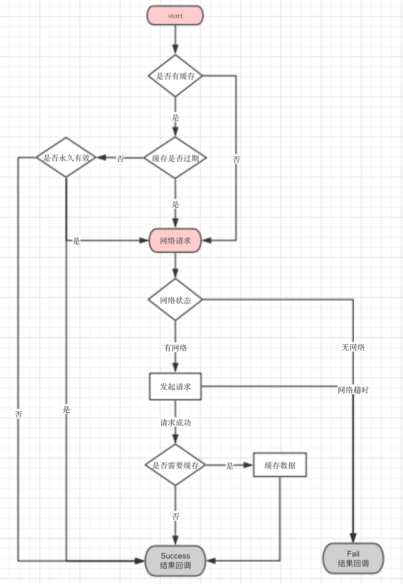

# AJNetworking

[](https://cocoapods.org/?q=AJNetworking)
[](https://ghit.me/repo/AbooJan/AJNetworking)

AFNetworking 3.0 版本的封装，结合MJExtension框架处理JSON序列化问题

项目中使用的网络请求服务器代码使用 `Node.js` 编写：[NetworkTest](https://github.com/AbooJan/NetworkTest)


* 网络请求结构图




## 安装

```
pod 'AJNetworking'
```


## 使用方法

#### 一、 网络配置
1. 全局网络配置，需要使用类 `AJNetworkConfig`  在  `AppDelegate` 中配置.

	```objective-c
	/// 服务器域名
	@property (nonatomic, copy) NSString *hostUrl;
	/// HTTPS 证书密码
	@property (nonatomic, assign) CFStringRef httpsCertificatePassword;
	/// HTTPS 证书路径
	@property (nonatomic, copy) NSString *httpsCertificatePath;
	```

 --

#### 二、 发起请求

1. 新建一个请求类继承自 `AJRequestBeanBase` , 一个响应类继承自 `AJResponseBeanBase` 。

	> #### 命名规则

	> 1. 请求类: `RequestBean` + `业务名称`

	> 2. 响应类: `ResponseBean` + `业务名称`

	> 3. 默认请求类跟响应类的 `业务名称` 必须相同

	> 4. 例如一个登录请求，请求类为：`RequestBeanLogin` , 响应类为：`ResponseBeanLogin`

	> 5. 如果请求类实现了方法：`- (NSString *)responseBeanClassName` , 则可以自定义响应类，名称可以不同，但依然需要继承自 `AJResponseBeanBase` 类。


2. 请求类里面的成员变量即为发起请求的入参，响应类里面的成员变量即为返回参数。

3. 请求类需要遵循协议：`AJRequestBeanProtocol` . 响应类需要遵循协议：`AJResponseBeanProtocol`

4. 网络请求的相关配置通过实现协议 `AJRequestBeanProtocol` 的方法。

5. 发起请求由类 `AJNetworkManager` 管理，里面负责网络的请求和返回数据的处理，示例：

 	```objective-c
 	RequestBeanDemoRegister *requestBean = [RequestBeanDemoRegister new];
    requestBean.userName = self.userNameTF.text;
    requestBean.pw = self.pwTF1.text;

    [AJNetworkManager requestWithBean:requestBean callBack:^(__kindof AJResponseBeanBase * _Nullable responseBean, AJError * _Nullable err) {

        if (!err) {

            // 结果处理
            ResponseBeanDemoRegister *response = responseBean;
            AJLog(@"userId:%@", response.data.userId);
        }
    }];
 	```

 --

#### 三、 文件上传

1. 请求类需要实现协议 `AJRequestBeanProtocol` 中的方法, 这个参考了 `YTKNetwork` 框架:

	```objective-c
	/**
 	 *  @author aboojan
 	 *
 	 *  @brief 当POST的内容带有文件等富文本时使用
 	 *
	 *  @return MultipartFormData Block
 	 */
	- (AFConstructingBlock)constructingBodyBlock;
	```

2. 方法实现示例：

	```objective-c
	- (AFConstructingBlock)constructingBodyBlock
	{
    	NSData *data = UIImageJPEGRepresentation(self.avatar, 0.8);
    	NSString *name = @"img";
    	NSString *formKey = @"img";
    	NSString *type = @"applicaton/octet-stream";

    	return AJConstructingBlockDefine {
        	[formData appendPartWithFileData:data name:formKey fileName:name mimeType:type];
    	};
	}
	```

3. 文件上传请求示例，跟发起普通请求一样：

	```objective-c
	RequestBeanUploadAvatar *requestBean = [[RequestBeanUploadAvatar alloc] init];
    requestBean.compid = @"1702487";
    requestBean.avatar = [UIImage imageNamed:@"testImg"];

    [AJNetworkManager requestWithBean:requestBean callBack:^(__kindof AJResponseBeanBase * _Nullable responseBean, AJError * _Nullable err) {

        if (!err) {
            ResponseBeanUploadAvatar *response = responseBean;
        }
    }];
 	```

 --

#### 四、文件下载

1. 文件下载跟普通请求不同，需要使用类 `AJNetworkManager` 中的以下方法：

	```objective-c
	/**
 	 *  @author aboojan
 	 *
 	 *  @brief 文件下载
 	 *
 	 *  @param requestBean        文件下载请求Bean
 	 *  @param progressCallBack   下载进度回调
 	 *  @param completionCallBack 完成回调
 	 *
 	 *  @return 当前下载任务线程
 	 */
	+ ( NSURLSessionDownloadTask * _Nullable )downloadTaskWithBean:(__kindof RequestBeanDownloadTaskBase * _Nonnull)requestBean progress:(AJDownloadProgressCallBack _Nullable )progressCallBack completion:(AJDownloadCompletionCallBack _Nullable)completionCallBack;;
	```

2. 文件下载请求类使用 `RequestBeanDownloadTaskBase`，使用示例：

	```objective-c
	RequestBeanDownloadTaskBase *downloadRequest = [[RequestBeanDownloadTaskBase alloc] init];
	downloadRequest.fileUrl = @"http://temp.26923.com/2016/pic/000/378/032ad9af805a8e83d8323f515d1d6645.jpg";
 	downloadRequest.saveFileName = @"desktop.jpg";
    downloadRequest.saveFilePath = [NSSearchPathForDirectoriesInDomains(NSDocumentDirectory, NSUserDomainMask, YES) firstObject];

    [AJNetworkManager downloadTaskWithBean:downloadRequest progress:^(int64_t totalUnitCount, int64_t completedUnitCount, double progressRate) {

        AJLog(@"下载进度：%lf", progressRate);

    } completion:^(NSURL *filePath, NSError *error) {

        if (error) {
            AJLog(@"下载失败：%@", [error description]);
        }else{
            AJLog(@"下载成功：%@", [filePath description]);
        }

    }];
	```


3. 下载任务控制, 通过下载请求返回的 `NSURLSessionDownloadTask` 实例来处理。

 	```objective-c
 	// 暂停任务
 	[self.downloadTask suspend];

 	// 继续下载
 	[self.downloadTask resume];

 	// 取消下载
 	[self.downloadTask cancel];
 	```

 --

#### 五、缓存

1. 读取已缓存数据跟发起普通请求类似，使用 `AJNetworkManager` 的以下方法：

 ```objective-c
 /**
  *  @author aboojan
  *
  *  @brief 读取缓存
  *
  *  @param requestBean 请求Bean
  *  @param callBack    读取缓存回调
  */
 + (void)cacheWithRequestWithBean:(__kindof AJRequestBeanBase * _Nonnull)requestBean callBack:(AJRequestCallBack _Nonnull)callBack
 ```

2. 如果要缓存请求数据，需要请求类实现协议 `AJRequestBeanProtocol` 的以下方法:

 ```objective-c
 /**
  *  @author aboojan
  *
  *  @brief 是否缓存请求结果,默认不缓存
  *
  *  @return YES，缓存；NO，不缓存
  */
 - (BOOL)cacheResponse;
 ```

3. 默认缓存是长期有效的，如果需要控制缓存的有效时间，需要请求类实现协议 `AJRequestBeanProtocol` 的以下方法:

 ```objective-c
 /**
  *  @author aboojan
  *
  *  @brief 缓存有效时间，单位为秒, 默认为0,即长期有效；
  *
  *  @return 有效时间
  */
 - (NSUInteger)cacheLiveSecond;
 ```

4. 发起请求的时候可以先读取缓存，当缓存不存在或已失效的时候才真正发起请求：

 ```objective-c
    [AJNetworkManager cacheWithRequestWithBean:requestBean callBack:^(__kindof AJResponseBeanBase * _Nullable responseBean, AJError * _Nullable err) {

        if (!err) {

            // 读取缓存
            [self handleReponse:response];

        }else{

            // 发起网络请求
            [self readFromNetwork];
        }
    }];
 ```

5. 目前已把缓存和网络请求结合在了一起，如果设置的是短期缓存，在有效期内不会发起真正的网络请求；如果是长期有效缓存，则会先读取缓存，然后发起网络请求。使用详情可以参考Demo

 ```objective-c
 /**
 *  @author aboojan
 *
 *  @brief 发起网络请求，有缓存
 *
 *  @param requestBean   网络请求参数模式Bean
 *  @param cacheCallBack 缓存读取回调
 *  @param httpCallBack  网络请求结果回调
 */
+ (void)requestWithBean:(__kindof AJRequestBeanBase * _Nonnull)requestBean
          cacheCallBack:(AJRequestCallBack _Nonnull)cacheCallBack
           httpCallBack:(AJRequestCallBack _Nonnull)httpCallBack;
 ```


 --

#### 六、全局缓存配置
1. 缓存配置类 `AJCacheOptions` , 提供3个可选配置项：

 ```objective-c
 /**
 *  @author aboojan
 *
 *  @brief 缓存存放路径
 */
@property (nonatomic, copy) NSString *cachePath;

/**
 *  @author aboojan
 *
 *  @brief 是否开启缓存自动回收，默认关闭
 */
@property (nonatomic,assign) BOOL openCacheGC;

/**
 *  @author aboojan
 *
 *  @brief 缓存过期时间,最小不能小于60s
 */
@property (nonatomic, assign) NSUInteger globalCacheExpirationSecond;

/**
 *  @author aboojan
 *
 *  @brief 缓存自动回收时间,最小不能小于60s
 */
@property (nonatomic, assign) NSUInteger globalCacheGCSecond;
 ```


2. 缓存配置跟网络配置一样，通过类 `AJNetworkConfig` 类设置，例如:

 ```objective-c
 AJCacheOptions *cacheOptions = [AJCacheOptions new];
 cacheOptions.cachePath = [documentsPath stringByAppendingPathComponent:@"aj_network_cache"];
 cacheOptions.openCacheGC = YES;
 cacheOptions.globalCacheExpirationSecond = 60;
 cacheOptions.globalCacheGCSecond = 2 * 60;
 networkConfig.cacheOptions = cacheOptions;
 ```


 --


#### 七、网络状态
通过类 `AJNetworkStatus` 获取当前网络状态，框架本身在网络配置完之后即开启网络监测。

```
- (AJNetworkReachabilityStatus)currentStatus;
- (BOOL)canReachable;
```


 ---


#### 八、网络请求Hub支持
1. 在 `RequestBean` 中实现以下方法

 ```
 /**
 *  @author aboojan
 *
 *  @brief 是否需要显示Loading，默认不显示
 *
 *  @return YES，显示；NO，不显示
 */
- (BOOL)isShowHub;

/**
 *  @author aboojan
 *
 *  @brief Hub提示文案,isShowHub设置为YES时才会生效
 *
 @return 提示文案
 */
- (NSString *)hubTips;
 ```

2. 通过类 `AJNetworkConfig` 类设置 `hubDelegate` ，然后在 `delegate` 中实现hub的显示。

 ```
 /**
 * 显示Hub
 *
 @param tip hub文案
 */
- (void)showHub:(nullable NSString *)tip;

/**
 * 隐藏Hub
 */
- (void)dismissHub;
 ```


 ---


#### 九、结束网络请求
1. 通过 `AJNetworkManager` 类的以下方法实现结束网络请求任务

```
/**
 根据 taskKey 结束目标网络请求任务

 @param taskKeyArray 任务Key数组
 */
+ (void)stopRequestTaskWithTaskKey:(NSArray<__kindof NSString *> * _Nonnull)taskKeyArray
```

2. 继承自 `AJRequestBeanBase` 请求数据Bean新增了一个获取 `taskKey` 的成员变量，在Bean赋值后可以获取。

3. 这样可以在控制器基类中暴露一个存放 `taskKey` 的数组，然后在通用的页面关闭方法或 `dealloc` 方法中把网络请求结束掉,减少资源占用。

 ---

## 感谢

   依赖框架   |
 ------------ |
 [AFNetwoking](https://github.com/AFNetworking/AFNetworking) |
 [MJExtension](https://github.com/CoderMJLee/MJExtension)    |
 [SPTPersistentCache](https://github.com/spotify/SPTPersistentCache) |
